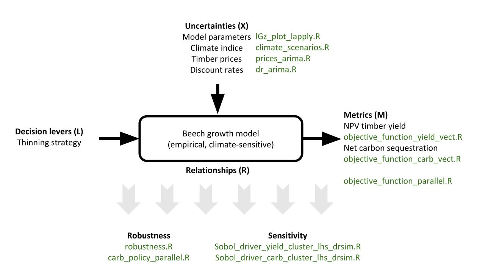

# Robustness and sensitivity analysis

This repository contains the analysis scripts on which the results of the manuscript "Identifying decision-relevant uncertainties for dynamic adaptive forest management" are based.
The analysis scripts are written in the R Programming language.

It contains the following scripts in the following sub-folders:
###/precalibration
- DEoptim_calibration_parallel.R
- lGz_plot_lapply.R

### /objectives
- objective_function_parallel.R
- objective_function_yield_vect.R
- objective_function_carb_vect.R

### /scenarios 
- climate_scenarios.R
- prices_scenarios.R
- dr_arima.R

### /evaluation
- robustness.R
- carb_policy_parallel.R
- Sobol_driver_yield.R
- Sobol_driver_carb.R

Note that in each of these scripts, some edits will be necessary:
- file names with date-stamps in the names
- folders that are pointed to for in- or output data

This repository DOES NOT contain:
- the forest growth model we used to actually run the analysis. It is a climate-sensitive, empirical beech growth model created by Trasobares et al. (2016) and was adapted for use in this study. 
- the data used to:
	- calibrate the model: individual tree long-term stand data (diameters and numbers at different stand ages)
	- input data to the model (initial stand data, climate projection data, harvest pattern data)
	- create climate scenarios: climate data by 5 Global Climate Models and 4 RCPs
	- create timber price scenarios: timber price index data
	- create discount rate scenarios: real discount rates on household deposits

We share these scripts to make the individual analysis steps transparent. We hope readers find them useful and can transfer them to their individual contexts of decision-making under deep uncertainty.

===================================================================
## WORKFLOW

### --> precalibration of the growth model parameters
Run DEoptim_calibration_parallel.R to find a best fit parameter set for the forest growth and yield model. We use the global optimization algorithm DEoptim() from the DEoptim R package to run the optimization between the range of the original model parameter values (Trasobares et al. 2016) +/- 5 * standard error. This script outputs a large sample of perturbations of this optimal parameter set.

Run lgz_plot_lapply.R which will calculate the stand's periodic volume growth for the sample created in DEoptim_calibration_parallel.R, for the observed data, for the best fit model parameter values and the original parameter values (by Trasobares et al. 2016). It subsets those samples that show an acceptable fit to the observed data. This subset represents the model parameter uncertainty and will be used to evaluate robustness and sensitivity of a thinning strategy to the ensemble of uncertainties.

### --> scenario creation
Run climate_scenarios.R, prices_scenarios.R and dr_arima.R to create the exogeneous uncertainty scenarios, namely climate, timber price and discount rate scenarios. They are all time-varying scenarios.

### --> objectives
The objective functions are wrappers around the beech growth model. Using the model output (stand's volume growth and harvested volume at different points in time) they calculate the two objectives: Net Present Value of timber yield and net carbon storage. The objective_function_parallel.R is sourced in the robustness.R and the objective_function_yield_vect.R and objective_function_carb_vect.R in Sobol_driver_yield.R and Sobol_driver_carb.R script, respectively.

### ---> evaluation of robustness and sensitivities
Run robustness.R which i) creates an uncertainty ensemble by enumerating all model parameter, climate, price and discount rate scenarios, ii) calculates the objective values for each uncertainty scenario using the objective_function_parallel.R and iii) derives the robustness of the current management strategy (Altherr thinning) which is the fraction of scenarios in which minimum performance requirements are fulfilled.

Run carb_policy_parallel.R which runs the forest growth model under each scenario to calculate the discounted net carbon storage in above-ground biomass and wood products. It then calculates how different carbon prices influence the level of robustness (i.e. the fraction of scenarios in which performance requirements are met) by setting the "carbon income" off against negative Net Present Values from timber yield.

Run Sobol_driver_yield.R and Sobol_driver_carb.R to calculate the 1st order and total Sobol' sensitivity indices, which indicate the relative impact of each uncertain factor on the objectives' variance. Sobol_driver_yield.R calculates these indices for the variance in Net Present Value of timber yield and Sobol_driver_carb.R for the variance in net carbon sequestration. The Sobol scripts source the objective_function_yield_vect.R and objective_function_carb_vect.R, respectively.

*Reference beech growth model: Trasobares, A., Zingg, A., Walthert, L., Bigler, C. (2016) A climate-sensitive empirical growth and yield model for forest management planning of even-aged beech stands. Eur J Forest Res 135(2), 263-282. DOI: 10.1007/s10342-015-0934-7.

Questions? Naomi Radke (naomikradke@gmail.com)

